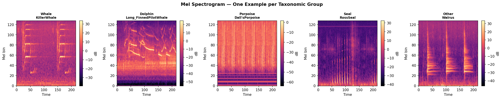
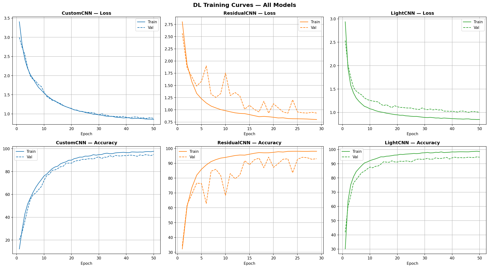
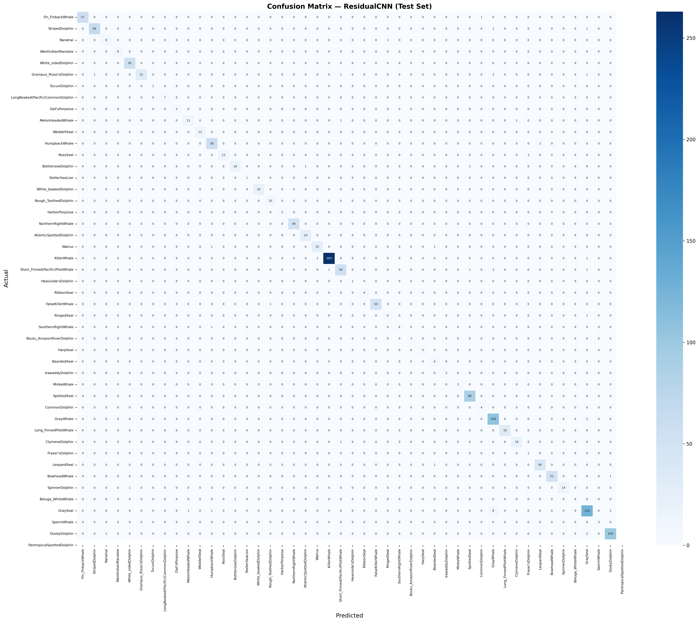
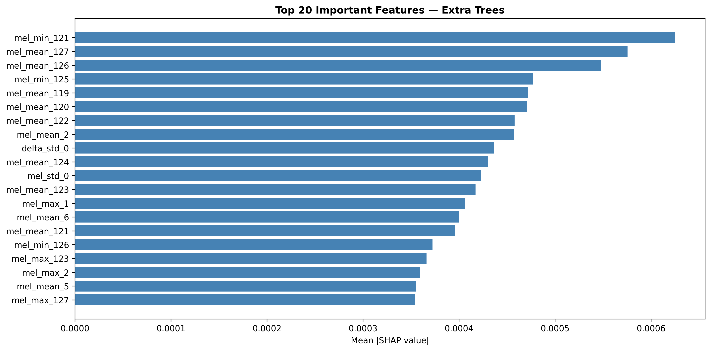
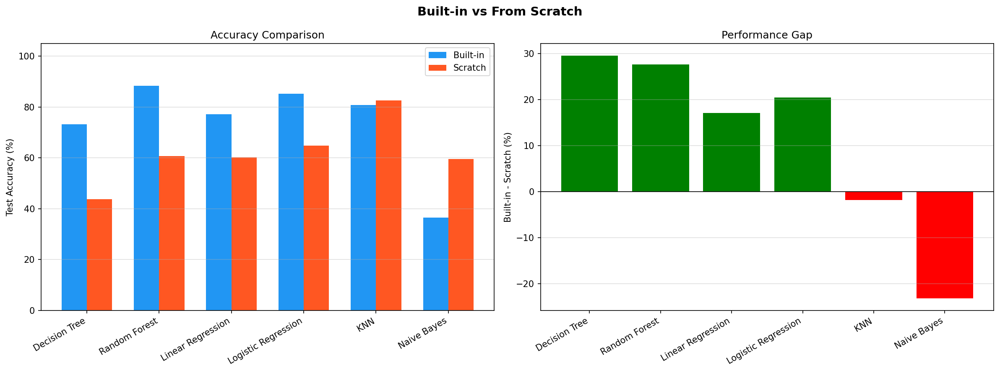

# 🐋 Marine Mammal Sound Classification

> AI system that identifies **47 marine mammal species** from audio recordings using Deep Learning & Classical ML — achieving **95%+ accuracy**


---

## 📌 Overview

| Item | Detail |
|------|--------|
| Dataset | Watkins Marine Mammal Sound Database (WHOI) |
| Files | 15,234 WAV files — 47 species |
| Pipeline (DL) | WAV → Mel Spectrogram → CNN |
| Pipeline (ML) | WAV → Statistical Features (774) → ML Models |
| Hardware | RTX 3050 Ti (4GB VRAM) |

---

## 🏆 Results

| Model | Test Accuracy | F1 Score |
|-------|--------------|----------|
| **ResidualCNN** 🥇 | **95.67%** | **95.68%** |
| LightCNN | 95.54% | 95.54% |
| CustomCNN | 95.41% | 95.39% |
| SVM (RBF) | 91.86% | 91.69% |
| Extra Trees | 89.17% | 88.60% |
| Random Forest | 88.32% | 87.73% |

---

## 🧠 Models

### Deep Learning (PyTorch)

| Model | Parameters | Architecture |
|-------|-----------|-------------|
| CustomCNN | 4.9M | 5 ConvBlocks + Global Average Pooling |
| ResidualCNN | 3.2M | Skip Connections (ResNet-style) |
| LightCNN | 145K | Depthwise Separable Convolutions |

### Machine Learning (sklearn + From Scratch)

Built **6 algorithms completely from scratch** without sklearn:

| Algorithm | Built-in (sklearn) | From Scratch |
|-----------|:-----------------:|:------------:|
| KNN | ✅ | ✅ |
| Naive Bayes | ✅ | ✅ |
| Logistic Regression | ✅ | ✅ |
| Linear Regression | ✅ | ✅ |
| Decision Tree | ✅ | ✅ |
| Random Forest | ✅ | ✅ |

---

## 🔧 Pipeline

```
WAV Files (15,234)
        │
        ▼
Mel Spectrogram (128 × 216)
        │
        ├─────────────────────┬─────────────────────┐
        │                     │                     │
        ▼                     ▼                     │
  DL Pipeline           ML Pipeline                 │
  ─────────────         ─────────────               │
  3 CNN Models          774 Features                │
  PyTorch + GPU         9 ML Models                 │
        │                     │                     │
        └──────────┬──────────┘                     │
                   ▼                                 │
     MLflow Tracking + SHAP Analysis                │
```

---

## 📊 Key Visualizations

### Mel Spectrograms — One Example per Taxonomic Group


### DL Training Curves — All Models


### Confusion Matrix — ResidualCNN (Test Set)


### SHAP Feature Importance — Extra Trees


### Built-in vs From Scratch Comparison


---

## 🚀 Quick Start

```bash
# 1. Clone the repository
git clone https://github.com/Ahmed-Al-Mohammadi/marine-mammal-sound-classification.git
cd marine-mammal-sound-classification

# 2. Install dependencies
pip install -r requirements.txt

# 3. Download dataset
# https://cis.whoi.edu/science/B/whalesounds/

# 4. Run notebook
jupyter notebook Code/MarineMammal_Classification.ipynb
```

---

## 📁 Project Structure

```
marine-mammal-sound-classification/
│
├── Code/
│   ├── MarineMammal_Classification.ipynb   ← Main notebook
│   └── class_labels_indices_whales.csv     ← Species labels (47 classes)
│
├── figures/
│   ├── mel_spectrograms.png
│   ├── dl_training_curves.png
│   ├── confusion_matrix_ResidualCNN.png
│   ├── shap_feature_importance.png
│   ├── builtin_vs_scratch.png
│   ├── imbalance_analysis.png
│   └── final_ranking.png
│
├── requirements.txt
├── .gitignore
└── README.md
```

---

## 🔍 Key Findings

- **High-frequency Mel bins (119-127)** are the most important features — biologically valid since dolphins & whales vocalize in ultrasonic ranges
- **ResidualCNN** outperforms all models due to skip connections preventing vanishing gradients
- **529x class imbalance** handled via `WeightedRandomSampler`
- Training time reduced from **300+ min → 40 sec/epoch** via Mel Spectrogram caching
- **Naive Bayes from scratch** (57%) outperformed sklearn (36%) because PCA features satisfy the independence assumption

---

## ⚙️ Tech Stack

| Category | Tools |
|----------|-------|
| Deep Learning | PyTorch, torchaudio |
| Classical ML | scikit-learn |
| Experiment Tracking | MLflow |
| Explainability | SHAP |
| Visualization | Plotly, Matplotlib, Seaborn |
| Audio Processing | torchaudio, MelSpectrogram |

---

## 📚 Dataset

**Watkins Marine Mammal Sound Database**
Woods Hole Oceanographic Institution (WHOI)

- ~2,000 unique recordings
- 60+ species (47 used after filtering)
- Recordings spanning 1940s–2000s
- First recordings of 51 species ever made

🔗 [Dataset Link](https://cis.whoi.edu/science/B/whalesounds/)

---

**Ahmed Yasser** | CS450 Machine Learning | Modern Academy Maadi | 2026
